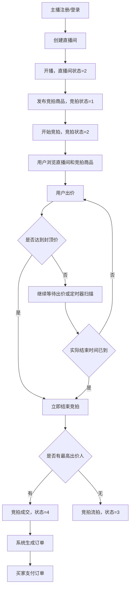

# 直播竞拍系统业务流程说明（master 分支）

本文按 `master` 分支源码梳理，用于业务人员理解核心接口背后的业务逻辑、状态流转和关键边界。接口测试细节请配合 `docs/api-response-reference-master.md` 与 Knife4j 使用。

## 业务角色

- 主播/商家：创建直播间、开播/下播、发布竞拍商品、开始竞拍、取消竞拍、查看自己卖出的订单。
- 用户/买家：浏览直播间和竞拍商品、参与出价、查看自己的出价记录和订单、支付订单。
- 系统：维护竞拍状态、定时结束到期竞拍、成交后生成订单、写入通知、推送 WebSocket 实时消息。

## 核心状态

### 直播间状态

| 状态值 | 业务含义 | 产生方式 |
| --- | --- | --- |
| 1 | 未开播 | 主播创建直播间后默认状态 |
| 2 | 直播中 | 主播调用开播接口 |
| 3 | 已下播 | 主播调用下播接口 |

业务限制：

- 一个主播只能创建一个直播间。
- 只有直播中的直播间才能发布竞拍商品。
- 开播时如果已是直播中，会提示“直播间已在直播中”。
- 下播时如果不是直播中，会提示“直播间未在直播中”。

### 竞拍状态

| 状态值 | 业务含义 | 可执行动作 | 下一状态 |
| --- | --- | --- | --- |
| 1 | 待开始 | 开始竞拍、取消竞拍、修改竞拍规则 | 开始后变 2，取消后变 5 |
| 2 | 竞拍中 | 用户出价、取消竞拍、系统结束竞拍 | 有最高出价人则变 4，无出价则变 3，取消则变 5 |
| 3 | 已结束/流拍 | 无 | 终态 |
| 4 | 已成交 | 无 | 终态 |
| 5 | 已取消 | 无 | 终态 |

状态机规则：

- 待开始竞拍开始时，系统写入开始时间、计划结束时间和实际结束时间。
- 竞拍中结束时，如果存在当前最高出价人，则该用户成为赢家，竞拍变为已成交。
- 竞拍中结束时，如果没有最高出价人，则竞拍变为流拍。
- 待开始或竞拍中的竞拍可以取消，取消原因会保存到竞拍商品上。

## 端到端主流程

## 认证与用户

### 注册

入口：`POST /api/auth/register`

业务逻辑：

1. 系统按用户名查询是否已存在账号。
2. 用户名已存在时，注册失败。
3. 用户名不存在时，创建新用户。
4. 密码使用 SHA-256 存储。
5. 昵称未传时默认使用用户名。
6. 角色未传时默认普通用户，角色值约定为 `1=主播/商家，2=普通用户`。
7. 新用户默认余额为 `100000.00`。
8. 注册成功后直接返回登录 token。

### 登录

入口：`POST /api/auth/login`

业务逻辑：

1. 系统按用户名查询用户。
2. 用户不存在时返回“用户不存在”。
3. 系统对入参密码做 SHA-256 后与库中密码哈希比对。
4. 密码错误时返回“密码错误”。
5. 登录成功后生成 JWT，token 中包含 `userId、username、role`。

## 直播间管理流程

### 创建直播间

入口：`POST /api/admin/room`

业务逻辑：

1. 从登录 token 中取当前用户 ID 作为主播 ID。
2. 系统查询该主播是否已有直播间。
3. 如果已有直播间，拒绝重复创建。
4. 创建直播间，默认状态为未开播。
5. 标题为空时默认“我的直播间”，封面、视频地址、公告为空时默认空字符串。

### 开播与下播

入口：

- `POST /api/admin/room/{id}/start`
- `POST /api/admin/room/{id}/stop`

业务逻辑：

1. 系统先校验直播间是否存在。
2. 再校验直播间是否属于当前登录主播。
3. 开播：直播间不是直播中时，状态改为直播中。
4. 下播：直播间必须是直播中，成功后状态改为已下播。

### 用户浏览直播间

入口：

- `GET /api/rooms`
- `GET /api/rooms/{roomId}/online`

业务逻辑：

- 用户端直播间列表只展示状态为直播中的直播间。
- 列表接口会附带在线人数。
- 直播中房间列表有 3 秒缓存。
- 在线人数来自 WebSocket 订阅关系，属于应用内存计数。

## 竞拍发布与管理流程

### 发布竞拍

入口：`POST /api/admin/auction`

业务逻辑：

1. 系统读取请求中的直播间 ID。
2. 校验直播间存在。
3. 校验直播间属于当前登录主播。
4. 校验直播间状态为直播中。
5. 创建竞拍商品：
   - 状态为待开始。
   - 当前价格等于起拍价，起拍价为空时按 `0` 处理。
   - 延时秒数为空时默认 `10` 秒。
   - 图片字段如果传单个 URL，系统会包装成 JSON 数组字符串；如果本来就是数组字符串则原样保存。
6. 创建成功后清理房间竞拍列表缓存和直播间列表缓存。

### 修改竞拍

入口：`PUT /api/admin/auction/{id}`

业务逻辑：

1. 系统查询竞拍商品。
2. 只有待开始状态可以修改。
3. 可修改商品名称、描述、图片、起拍价、加价幅度、封顶价、持续分钟数、延时秒数。
4. 修改成功后清理相关缓存。

实现边界：

- `master` 分支中，修改竞拍时没有校验竞拍是否属于当前登录主播。

### 开始竞拍

入口：`POST /api/admin/auction/{id}/start`

业务逻辑：

1. 系统查询竞拍商品。
2. 状态机校验当前状态必须是待开始。
3. 写入：
   - 开始时间：当前时间。
   - 计划结束时间：当前时间 + 持续分钟数。
   - 实际结束时间：初始等于计划结束时间。
   - 状态：竞拍中。
4. 更新数据库。
5. 清理竞拍详情、房间竞拍列表、直播间列表缓存。
6. 发布竞拍状态变更事件。
7. 通过 WebSocket 向直播间广播 `STARTED` 事件。

### 取消竞拍

入口：`POST /api/admin/auction/{id}/cancel`

业务逻辑：

1. 系统查询竞拍商品。
2. 状态机判断当前状态是否允许取消。
3. 保存取消原因。
4. 状态改为已取消。
5. 更新数据库并清理缓存。
6. 发布竞拍状态变更事件。
7. 通过 WebSocket 向直播间广播 `CANCELLED` 事件。
8. 通知监听器会给参与过该竞拍的用户写入取消通知。

实现边界：

- `master` 分支中，取消竞拍时没有释放或冻结资金的逻辑，因为出价阶段本身不冻结资金。

## 用户出价流程

入口：

- REST：`POST /api/auction/{id}/bid?amount=xxx`
- WebSocket：客户端向 `/app/bid` 发送 `{itemId, userId, amount}`

业务逻辑：

1. 系统查询竞拍商品，不存在则返回“竞拍不存在”。
2. 校验竞拍状态必须是竞拍中。
3. 校验出价金额必须大于等于 `当前价 + 加价幅度`。
4. 校验出价不能超过封顶价。
5. 校验用户余额必须大于等于本次出价金额。
6. 尝试获取 Redisson 分布式锁，锁 key 为 `lock:bid:{itemId}:{userId}`。
7. 获取锁失败时，提示“操作太频繁，请稍后再试”。
8. 如果距离实际结束时间小于等于延时秒数，系统将实际结束时间向后顺延一次。
9. 保存新的当前价、当前最高出价人、出价次数。
10. 新增一条出价记录。
11. 更新 Redis 排行榜，分数为出价金额，成员为用户 ID。
12. 通过 WebSocket 向直播间广播最新出价。
13. 如果发生延时，广播 `DELAYED` 事件。
14. 如果存在上一位最高出价人，向上一位最高出价人定向推送被超越消息。
15. 如果本次出价达到封顶价，系统立即结束竞拍。
16. 最后释放锁并清理竞拍详情、房间竞拍列表缓存。

业务效果：

- 用户可以在直播间实时看到最新价格、出价人昵称、出价次数。
- 被超越用户会收到点对点 WebSocket 通知。
- 出价排行榜可展示 Top 20。
- 临近结束时出价会自动延时，减少“卡秒”成交。

实现边界：

- `master` 分支出价时只校验余额，不冻结余额；真正扣款发生在订单支付时。
- 锁 key 包含用户 ID，因此同一商品不同用户同时出价时不是同一把锁，极端并发下以数据库最终写入为准。
- 出价前不单独校验实际结束时间是否已过期，只依赖每秒定时任务把到期竞拍改为结束状态。
- 当前最高出价人重复出价没有被专门拦截，只要金额满足加价规则即可继续出价。

## 竞拍结束与成交流程

触发方式：

- 用户出价达到封顶价，立即结束。
- 定时任务每秒扫描一次，找到状态为竞拍中且实际结束时间已到的竞拍，然后结束。
- 后台也可调用服务层结束方法。

业务逻辑：

1. 状态机处理竞拍中商品。
2. 如果存在当前最高出价人：
   - 将最高出价人写为赢家。
   - 竞拍状态改为已成交。
3. 如果不存在当前最高出价人：
   - 竞拍状态改为已结束/流拍。
4. 更新数据库并清理缓存。
5. 发布竞拍状态变更事件。
6. 通过 WebSocket 广播：
   - 成交：`SOLD`，包含赢家和最终价。
   - 流拍：`ENDED`。

## 订单流程

### 自动生成订单

触发：竞拍状态变为已成交。

业务逻辑：

1. 订单监听器监听竞拍状态变更事件。
2. 只有新状态为已成交且存在赢家时才生成订单。
3. 系统根据竞拍商品创建订单：
   - 商品 ID：竞拍商品 ID。
   - 买家 ID：赢家 ID。
   - 卖家 ID：竞拍商品的主播 ID。
   - 最终价：竞拍当前价。
   - 订单状态：待付款。
4. 订单生成后买家可在“我的订单”中查看。

实现边界：

- `master` 分支没有判断同一竞拍是否已有订单；重复触发成交事件可能产生重复订单。
- 订单生成时没有再次校验竞拍状态是否为已成交，也没有校验买家是否一定是赢家；它信任事件来源。

### 支付订单

入口：`POST /api/order/{id}/pay`

业务逻辑：

1. 系统查询订单。
2. 订单不存在则返回“订单不存在”。
3. 校验订单买家必须是当前登录用户。
4. 校验订单状态必须是待付款。
5. 查询买家余额。
6. 买家余额不足则支付失败。
7. 扣减买家余额。
8. 订单状态改为已支付，写入支付时间。

实现边界：

- `master` 分支只扣买家余额，未看到卖家入账逻辑。
- 没有支付渠道、退款、超时关闭订单等扩展流程。

## 通知与实时消息

### WebSocket 广播

订阅地址：

- 直播间公共消息：`/topic/auction/{roomId}`
- 被超越点对点消息：`/user/queue/outbid`

广播内容：

- `BID`：新出价，推给直播间所有人。
- `DELAYED`：竞拍延时，推给直播间所有人。
- `STARTED`：竞拍开始，推给直播间所有人。
- `SOLD`：竞拍成交，推给直播间所有人。
- `ENDED`：竞拍流拍，推给直播间所有人。
- `CANCELLED`：竞拍取消，推给直播间所有人。
- `OUTBID`：被超越通知，只推给上一位最高出价人。
- `ONLINE`：在线人数变化，推给直播间所有人。

### 站内通知入库

触发：

- 竞拍成交。
- 竞拍流拍。
- 竞拍取消。

业务逻辑：

- 成交时，赢家收到“拍得商品”通知。
- 成交或流拍时，所有参与出价但未获胜的用户收到“竞拍已结束”通知。
- 取消时，所有参与出价的用户收到“竞拍已被主播取消”通知。

## 缓存策略

| 缓存 key | 内容 | 有效期 | 失效时机 |
| --- | --- | --- | --- |
| `cache:rooms:live` | 直播中的直播间列表 | 3 秒 | 发布、修改、开始、取消竞拍时清理 |
| `cache:room:{roomId}:auctions` | 指定直播间竞拍列表 | 2 秒 | 发布、修改、开始、出价、结束、取消竞拍时清理 |
| `cache:item:{itemId}` | 竞拍详情 | 2 秒 | 开始、出价、结束、取消竞拍时清理 |

业务含义：

- 用户端短时间内看到的直播间和竞拍详情可能有 2-3 秒缓存延迟。
- 出价成功后会主动清理缓存，降低价格展示延迟。

## 业务人员重点关注点

- 主播完整链路：注册/登录 -> 创建直播间 -> 开播 -> 发布竞拍 -> 开始竞拍 -> 用户出价 -> 成交/流拍 -> 查看订单。
- 用户完整链路：注册/登录 -> 浏览直播间 -> 进入竞拍 -> 出价 -> 被超越/领先 -> 成交后查看订单 -> 支付。
- 竞拍成交的核心判断只看“结束时是否存在当前最高出价人”。
- 达到封顶价会立即成交，不必等待倒计时结束。
- 临近结束的有效出价会延长实际结束时间。
- master 分支没有出价冻结资金、卖家结算、订单去重、角色强校验等增强能力，这些如需作为正式业务规则，需要单独确认和补充实现。
